| Date started: May 21, 2026

# Pagtingin V2
Okay. I think it is time to start working on this project again. It's been literally almost a year since I've touched this project and all I can say is that I've changed a lot in those years. Now, we're back in Summer 2026 to work on this.

I guess to start, I would like myself to check up on why I gave up on this in the first place
- Clearly, it failed because I switched the positions of the pins of the MCU. So technically, I was quite literally trying to make it work but I had swapped the footprint pins to connect to different signals that weren't actuallly  the right footprint pins in thea actual footprint. Okay, so to explain on it much simpler, I switched each pins of the footprints to make routing easier. however, in the adctual footprint, no pins are switched, making the signals i've connected not corresponding to the actual footprint.

So that is definitely one problem, I would say.

Here's the complete list of problems that I noticed while making the PCB

1. Both PCBs were INCREDIBLY messy as hell. There were so many wires going through each of them, and it just didnt look good.
2. How the hell do you even program an ESP chip? This were mainly one of the main reasons why everything became messy
3. Some things weren't available when I asked JLCPCB to  solder all of the parts in the PCB. Also yeah, my soldering was js plain messy
4. Didn't account for some measurement of the 3d print
5. 3d printed glasses' hinges didn't work
6. And of course, the ESP32's footprint layout was wrong.

Clearly, there were so many problems here because I was so rushed into making this for Highway. But worry not, I'll try to fix them this summer.

## First Problem: How to program the ESP32-PICO-D4
I guess the first thing I can start working on is how would you even try programming the ESP32-PICO-D4 if its just a sole chip?

To program it you would need to use a USB-TO-UART bridge and programming it via the Arduino IDE.

I guess also one of the main reasons why we couldnt program the ESP32-PICO-D4 was that the pogo pins didn't fit the holes.
- This was also to me messing with the footprint's sizes.

So apparently the ESP32-PICO-D4 uses a UART bootloader mode in which it allows for firmware to be flashed over the serial communication protocol, UART.
- For this project, I think we can keep the FT2232HL-Based flashing

## Second Problem: How to know if the power delivery is working?
We test with the current version and see with a multimeter tester if the power delivery is indeed working as intended.

## Third problem: 3D Printed Hinges
The temples were okay and the PCB was able to fit but the problem was that the hinges didn't quite connect with each other.

We would probably need to add little tweaks to the 3D print and most likely try to see if it shall work.

I'll research on the META glasses how did they fit PCBs in their frames.

Going through the teardown of the meta rayban glasses, I noticed that they use a lot of flex PCBs. Flex PCBs, frankly, are quite a foreign term for me.
But as I understand, they are more of like

Quick notes:
- All the frames and the arms are made of plastic (NOT 3D PRINTED)
- Flex PCBs are more of used to houses the sensors such as proximity and light

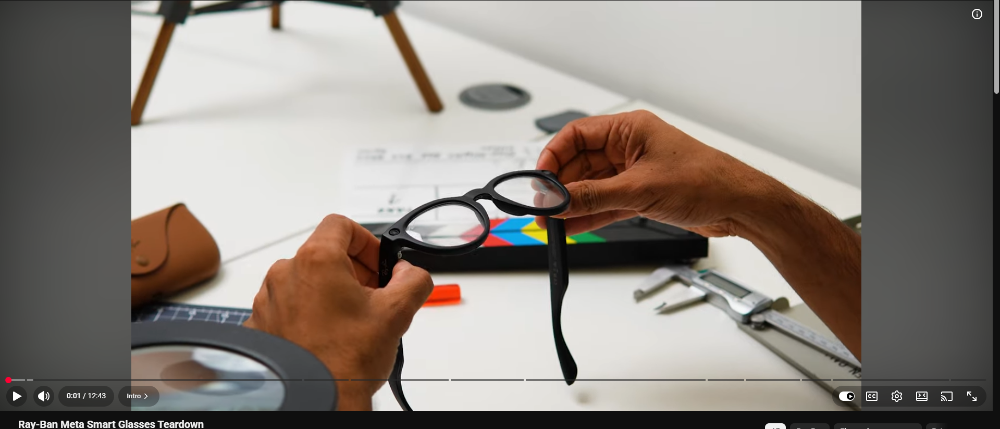
So clearly, that teardown had my head not working anymore. I feel so overwhelemd redesigning all of this, so I think here are a couple of suggestions to make this project much less complex.

1. Use a ESP32 Module instead of the chip
2. Use templates from websites such us thingiverse and merge them with my current design
3. Sanity check from people

# Entry 01 - 05-27-26 - Starting with reducing the complexity of the project

Okay, ever since I've found out how complex this project was, I've always kept pushing that all will be fine and that I'd be able to get this done easily.

However, I don't think I can do that anymore. It's finally time.

Here were some problems things that I thought would be increasing the complexity of my project:
1. The microcontroller as a chip
2. FFC connectors 

First let's solve the problem of the microcontroller being a chip
- Honestly, trading it for the size, I just dont think I'll be replacing the chip for a devboard or whatever

FFC and FPC connectors
- I think it would be better if I got flex pcbs so that it can travel within the temple, frame, and temple pretty easily.

Studying the meta glasses teardown, apparently the way the two temples are connected to each other is this order:
Any temple -> hinge -> front frame PCB (in between in the lenses)

And then basically the front frame PCB connects both temple's pcb
- I have no idea how I am going to ever reach that level of making a pcb

For meta glasses the way they do is that:
- Two halves of a temple are glued together

According to GPT, the best way to connect the two boards is to use a Flex PCB.
Another very bad problem is that the 3d print isnt hollow.

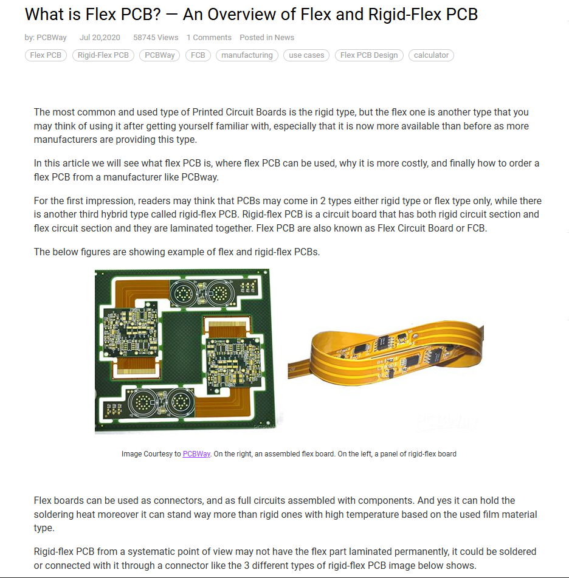

Also for today, I tried to restore my files.

Anyways for the next journal, I plan to change up the 3D  Model. I think the PCB couldve been way better if I changed up that.

# Entry 02 - 05-29-26 - Changing up the structure of Pagtingin

I am  revisiting back my 3D models for the Pagtingin. And yeah, honestly making all of it connect like the Meta Glasses will be hard because

Internal wiring is super complicated. I've tried that out in version 1 and I underestimated how complex it can be.

Hence, I thought of a new idea. What if we truly made it so modular? What if, like earbuds, we have different electronic pods around the glasses and each of those pods would have different modules with different functionality?

Introducing...

Pagtingin V2! (Picture made by CHATGPT)

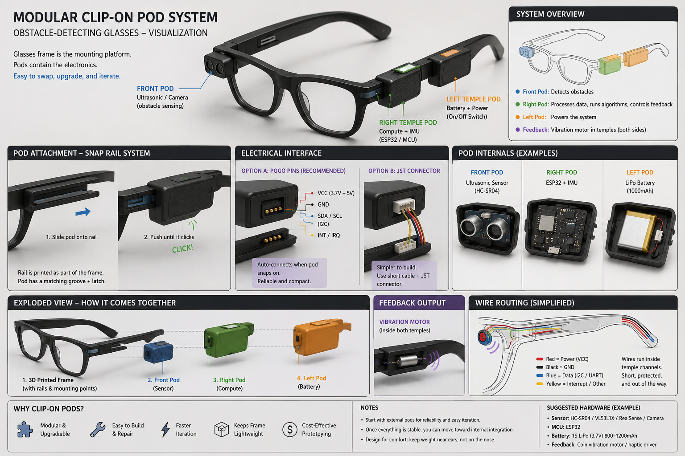

Okay so I believe this type of modular approach would not only reduce the complexity but also help a lot in debugging as it separates itself now in 3 zones.

So yeah! Let's start with revising the schematic first by making them into different PCBs.

So we'll be primarily separating the glasses into three parts:
1. The Main Board module
- This includes the brain (MCU)
- The main logic (audio and stuff)
- Also main regulation happens here

2. The Power System 
- This includes the battery itself and the power modules
- Includes: battery, charger, regulations, and protetions

3. Sensing module
- Includes the input 
- Facing front of the glasses

4. Audio module
- Includes the output modules 

What's next is to sanity check first the electrical connections and then lets make that PCB for the electronic pods!

Let's make this a cool ass project frfr

Oh yeah apparently, I also have to decide on a system bus. It's basically how will each module communicate and transfer power. For communication, I'd use:

Main Communication protocol
I2C 

Power rails
And for power rails, I think I'd rather keep the current power rails right now. Maybe I'll modify them depending on it.

And control / utility lanes
- RESET BUTTON
- INT
- EN 
(Would connect these to the power system)

# Entry 03 - 05-30-26 - More ideas + revising the schematic

So I went on consulting with a friend about my glasses. He suggested that I use a power bank cable to represent the PCB. Then it would come from your pocket, routing to your glasses.

I believe this one is quite intriguing because it opens up to the fact that its ergonomically better. Less weight and all.

However, I still wanna go for the modular approach.

Oh yah, for the main board here are some things I need to think of:
1. How am I supposed to connect the modules together with the ESP32-PICO-D4 chip?
- Perhaps I can use soem sort of things to breakout these pins?

2. How am I supposed to program this? Perhaps its Pogo pins are exposed for me to program it with my current EPS32-PROG
- Same situation with this

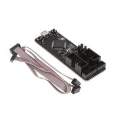

Also apparently you can pre-program chips so that's definitely interesting.
- You can use a pogo-pin jig to program them so u dont have to put headers anymore
- To do this you will need to expose the copper pads of those pins
- This is the one i picked
- Now it's only a matter of having a pogo pin jig
And then you can also pre-program them by using a chip socket programmer   
- Only do this if you're confident that your firmware will work

In terms of the other pins, I have decided to use JST connectors so that it can make permanent connection
- The cables will be inside the glasses frame, routing using the system bus to other modules in the system

I decided to go with using FFC connectors so I can connect the modules with each other.

There's like nuance here that I have to keep in mind and its that I should be using a system bus with the fixed amount of pins
- That basically means that I will be placing let's say a FFC connector with a fixed number of pins. The same pins should be used as a FFC connector to the other modules but each nodule ONLY takes what it needs

For example:

Each module will have a 14 pin FFC connector. Even if a module doesnt need one of those signals, it will still have the same amount of pins. However, the signals it doesn't need will be NOT CONNECTED (NC)

Anyways, I will be checking each hierarchical schematic and see what signals do each module need. And then, we can decide on how many pins the FFC Connector should have.

Also just a reminder to take a look at LCSC so that we know what is in stock and if JLCPCB can do PCB assembly with that.

# Entry 04 - 06-02-26 - Implementing the FFC Connectors

So here are the signals we primarily need that need to be universal with all modules:

3.3V
5V
GND (Power)
SDA (IO 21, For TOF Sensor)
SCL (IO 22 For TOF Sensor)
GND(Sensor)
I2S_LRCK (IO32 for the PCM5102)
I2S_DIN (IO33 for the PCM5102)
I2S_BCK (IO27 for the PCM5102)
I2S_SCK (IO26 for the PCM5102)
I2S_XSMT (IO25 for the PCM5102)
GND (Digital)
SHND (IO23 for the PAM8403DR0)
GND(Shield)
LPN (IO18 for the TOF sensor)
INT (IO19 for the TOF sensor)
I2C_RST (IO4 for the TOF sensor)
GND(Another shield)

Hence, we need a FFC connector with at least 18 pins. I think that's the safest.

Also, while listing down the pins I needed, something came to mind:
"Is one Time of Flight sensor really fine?" I've been meaning to answer this question. There are pros and cons if I do only have one and two.

One TOF Sensor:
- Less coverage for the vision
- In a sense "tunnel vision"

Two TOF Sensors:
- More coverage
- More complexity

One TOF sensor & 1 IMU
- Best out of all the options
- The TOF sensor detects an obstalce in front while the IMU refines that result into something much more specific
- Basically the IMU gives the context of the situation while the TOF sensor sees

So yeah it'll definitely be helpful if I had an IMU sensor giving context to the entire system of what's happening.

Okay another thing would be:
- Do we separate the things off the main board? Yes and no. What's better is that we separate the distance sensors from the main board so that we may make it more modular, and then we put the IMU sensor and  main board together so that they can both working together to produce data that the entire system needs.

Okay here's the revised architecture:
🧠 Main module (processing + power processing)
🎧 Audio module left
🎧 Audio module right
📡 Sensor module(s)

Here's an AI created image. Apologies if I make these with AI, but I believe it is faster to prototype if that's the case:
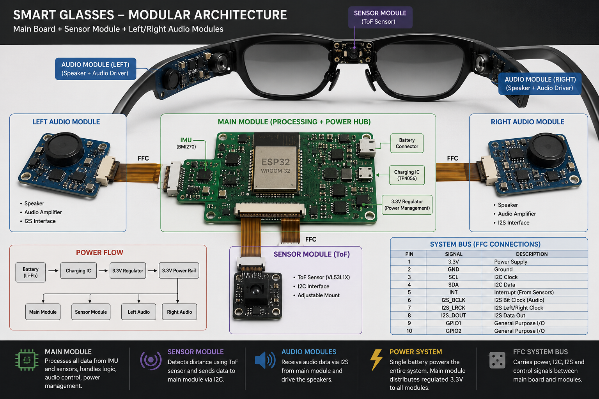

With that, I put 3 FFC connectors with 16 pins each on the main board.
- I js gotta worry about the vertical clearance

Next time im gonna pick out the best FFC connector.

# Entry 05 - 06-05-26 - Implementing the FFC Connectors (fr this time)

 
Okay! so I've finally implemented the FFC connectors. Just thinking whether or not we should use 3 FFC Connectors for this.

So introducing the AFC07-S18FCA-00:

It is a 18 pinned FFC connector with a pitch of 0.5mm. It's a pretty standard FFC connector and I believe it'll be able to fit inside the glasses.

Also I recently started using this new tool called easyeda2kicad. This helps with my workflow  ALOT. Like genuinely, I don't have to keep converting the files I see on easyeda to kicad with a web browser. It just does it on my terminal.

Okay, so I've successfully integrated the FFC connectors to the different modules.

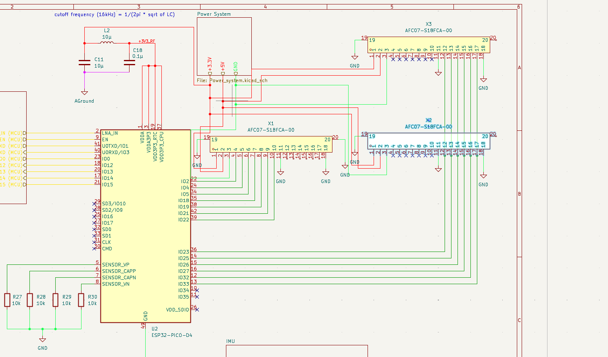
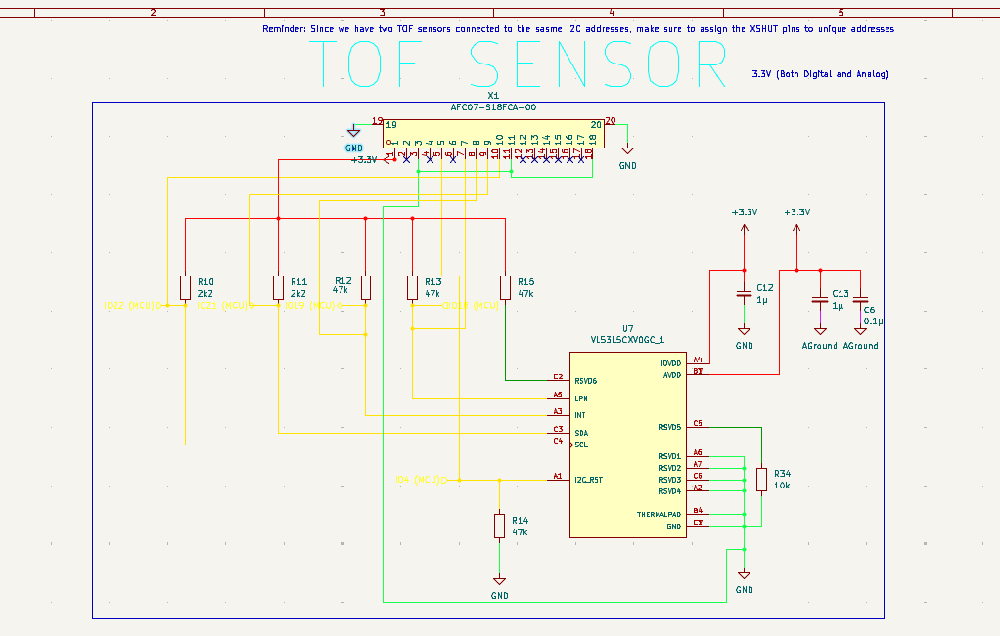
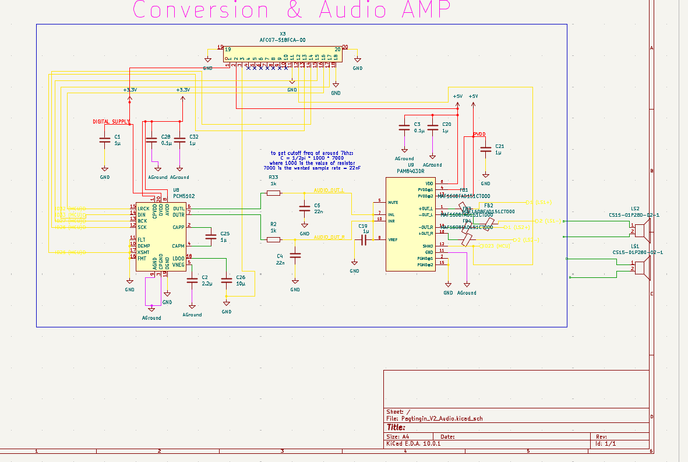

For the next session, I wanna try probing on the different electrical connections in the PCB from the version 1 of the project. I wanna see if the power system I created in version 1 works with the current system.

# Entry 06 - 06-06-26 - Connecting the IMU to the MCU

Okay so I'm just gonna do a small thing today and its connecting the IMU to the respective pins of the MCU.

Yep. After following the datasheet, here is what I ended up with:

Also learned that some things can be left unconnected depending on their purpose in the overall system. So for this BMI270, I left u unconnected ASC, ASD, OCSB, and OSDO because they were all used for auxilliary connections. And yeah, by name, "auxilliary" basically means support or extra features in this case.

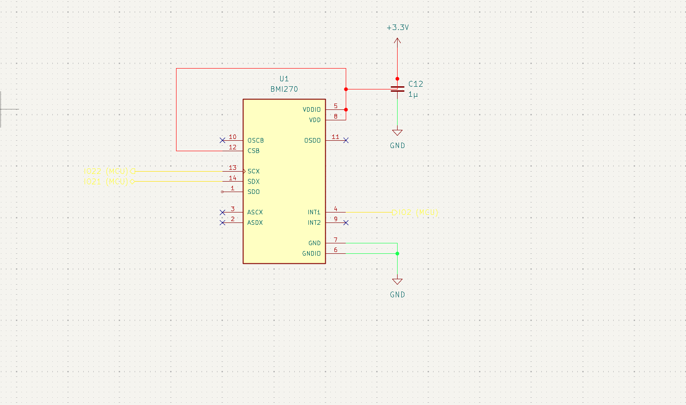

# Entry 07 - 06-10-26 - Back to revising the power system

Okay so what I'm generally concerned for is my latching circuit. I'm not so sure if it works, even when I transferred it over to a new board.

See the image below:

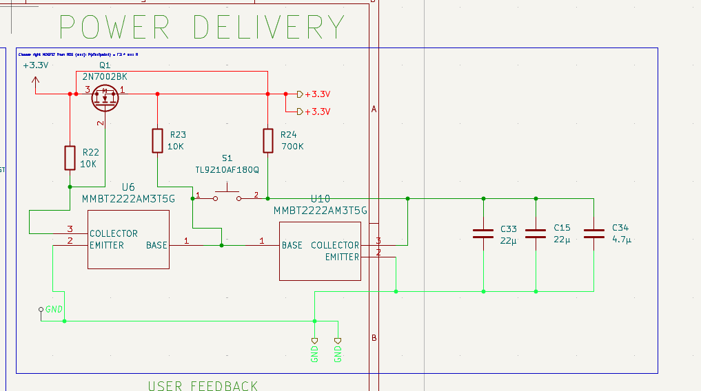

Okay, so according to chatgpt, I asked the AI to do a sanity check of my latching circuit.

To understand latching circuits, is to also core to understand feedback loops.
- The core idea of a feedback loop is that the latching output is fed back in the input in order to keep itself alive (the system)

The building blocks of a latching circuits are:
- NOR or NAND gates
- The SR latch is the simplest digital latch; it has two inputs which are SET (sets the output on) and Reset (sets the output off) 

It basically said that I used the wrong type of MOSFET, an N-channel MOSFET, instead of a P-channel MOSFET.

Just to explain it, an N-channel MOSFET is basically used for high-side switching.

Here's an article detailing latching relay:
https://www.instructables.com/The-Most-Efficient-Latching-Circuit/  

So what is a relay?
- Its an electromagnet controlling a switch

That concludes some learning for today. my brain's ultimately fried

# Entry 08 - 06-11-26 - Revising the power system v2

Okay so I wanna implement the knowledge above to revise my power system.

In my latching circuit, I'm going to replace the the 2N7002BK transistor because its not the right type of transistor that I need.

To do this we must first understand what is high-side switching and low-side switching
- High-side switching is when the switch is placed between the power source and the load itself
    - When the switch is closed, power flows into the load. When the switch is open, the connection to the power supply is cut off completely.
- Low-side switching is when the switch is placed between the load and the ground
    - The load is always physically connected to the power supply. The switch acts as a gatekeeper to the ground. When you close the switch, it completes the path to ground, allowing current to flow.

And to get deeper into electronics and all of that, a MOSFET is basically a voltage-controlled valve
- Gate (the lever)
- Drain (Water coming in)
- Source (water going out)

So the way this works is that the gate gets a little bit of voltage. That mere presence of voltage creates an electric field that pulls the valve open.

Also I needed to replace the NPM1100-CAAA-R7. Reason being, in version 1, it was so hard trying to hot plate such small component. Hence, I'm going to use a different IC now which does a similar functionality to replace that so that it makes assembling the main module a bit easier. 

I'm going to replace it with a new charging module now. Plus maybe an LDO.

I'll do that tomorrow 

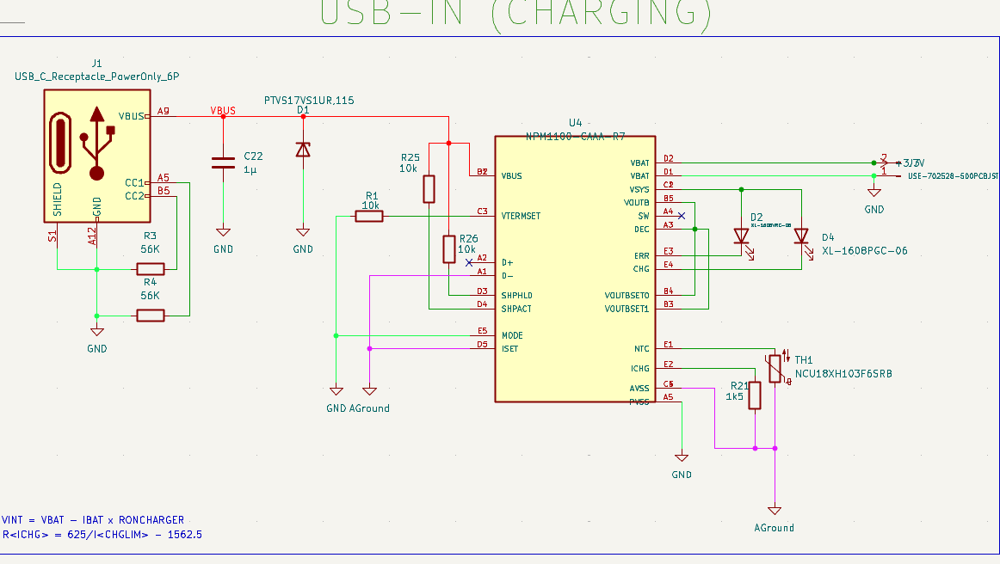

# Entry 09 - 06-12-26 - Revising the power system v3

So to replace the NPM1100-CAAA-R7, let's go try finding a similar IC like it.

So I found out about TP5400 and TP4056

The key difference  between the two modules 
- TP4056 simply takes in a 5V and safely charges the 3.7V
- TP5400 can do both charging and do a boost regulator

For this situation, having the TP4056 would be much more convenient. And then we pick a LDO.

For an LDO we must first understand these terms:
- Dropout voltage which basically is the minimum voltage that the LDO needs between the input and output to keep the output steady
- Ground current is the electrical "tax" that the LDO charges just to stay powered on and working

The LDO I picked was the XC6206P332MR
- The reason being is that it fits the specs I need in an LDO. It dropouts to 3.3V and gets current at 200mA at most.
(I just realized that I didn't need an LDO cuz i already had a buck converter lamo)

Calculating for the PROG pin of the TP4056:
RPROG = 1200/0.6

RPROG = 2000 Ohms

Some sources:
- https://www.allaboutcircuits.com/technical-articles/choosing-the-right-ldo-beyond-the-basic-specs/

Here's the revised schematic of the USB-C part of the power system:

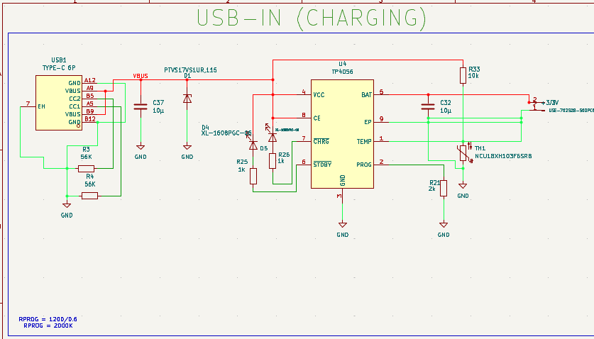

Okay next is I had AI sanity check my boost converter and buck converter to see if they were truly doing what I wanted them to do.

So apparently my boost converter had some problems with values:
- R9's value 47K -> 36K 
- Only having one capacitor on the output capacitance bank

For my buck converter:
This part was really well done. Just to polish it I just had to replace some values:
- C16's value is now 22pf
- R16's value is now 360k 
- R17's value is now 80.6K

Everything should be good now!
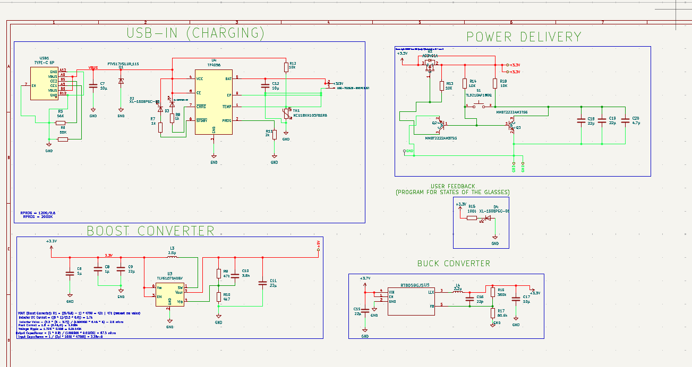

# Entry 10 - 06-16-26 - Revising the audio schematic

Okay so now I've also noticed another problem with what happened with version one.

The speakers I bought weren't exactly THT that's why we couldnt really solder them onto the board. Well now, let's find for speakers.

Of course, as always, the benchmark would always be the meta glasses. I am really fascinated by this technology.

Found this little document by digikey:

https://mm.digikey.com/Volume0/opasdata/d220001/medias/docus/7182/CE%20Speaker%20Assembly%20Overview.pdf

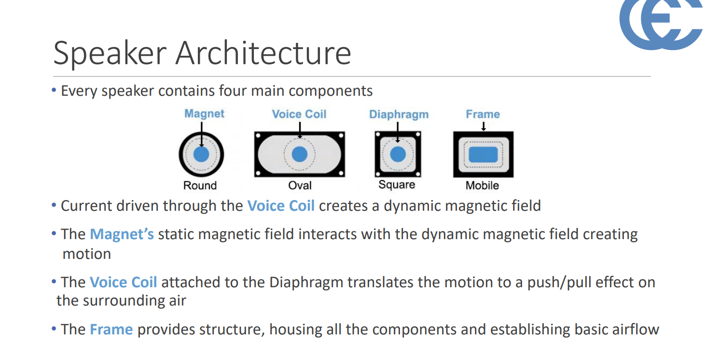

So apparently, we'd just have to stick with the old way. Connecting my speakers via a JST connector.

Also begs another question:
- How do i plan to wire the PAM8403 if I'm only using one speaker for one audio module? What about the OUT_R and OUT_L 

Better idea instead of creating a new file:

export a file first with one side of the speaker

and then afterwards we can make changes to the schematic and then do it for the other side of the ear.

So here's the final schematic of the audio schematic. Not much changes were made! Just wanted this to be sanity checked by Gemini.

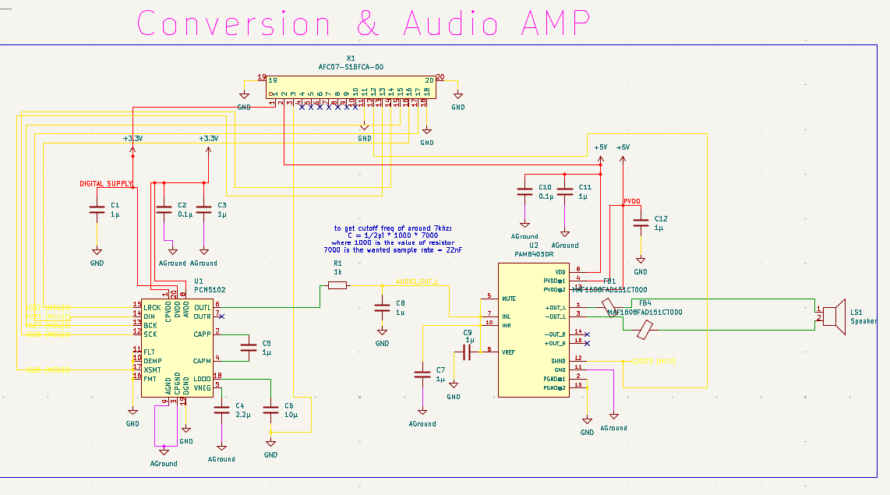

Okay next thing that popped into my head:
- DGND vs AGND

So connecting to the DGND are for if you have noisy components such as
and then AGND is the quiet part of the schematic in which you will connect components that are susceptible to a lot of noise, and a lot of noise makes the electrical connections inconsistent.

But yeah, I'll be doing that star grounding in the PCB itself. Hopefully I don't forget.

But anyways, that's pretty much it for this.

# Entry 11 - 06-19-26 - Making the PCBs for all the modules

Okay so for this session, I tried brainstorming for a great shape for the PCB of each module. Turns out, if I want to make this be mounted on a pod, I'd have to just make it into a simple chamferred rectangle shape.

Yep! Now, getting back to the routing. Here's the final routed pcb:

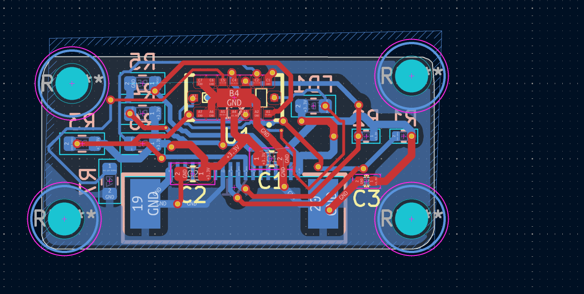

Sensor PCB! (Will add mounting holes)

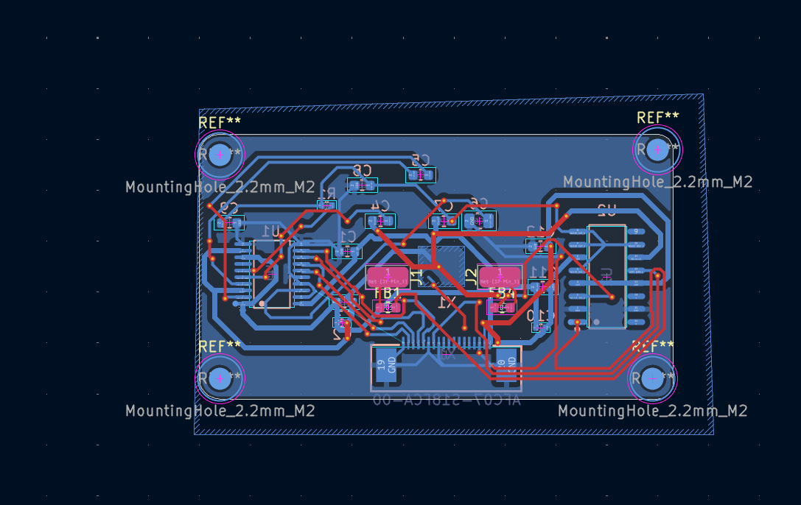
Audio PCB!

Also adding mounting holes for M2 screws in the PCB so we can attach it in the 3d model im going to do (the said pods)

Okay so now for the main pcb.

Let's make the chip to the front
make the fpcs to the front?
power stuff, at the back

I actually forgot to add the pogo pins for programming the system. Actually no we don't need that hahahhaa.
I'll just get a programming pogo pin testing jig so I can program it without having any permanent obstructions in the pcb.

Here's how it looks like right now:

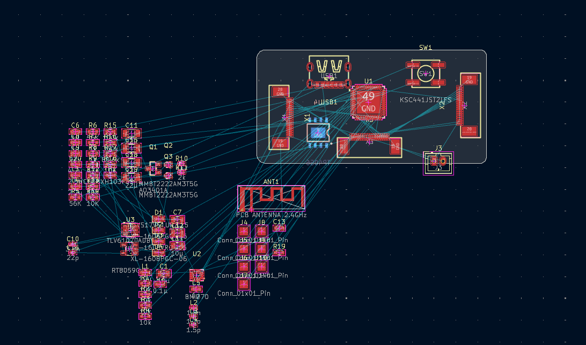

Should be finished tomorrow with the 3D Model design!

# Entry 12 - 06-20-26 - Making the PCBs for all the modules

Well yeah, as the journal title said, It's literally just mostly me routing. You can see the timelapse.

Also decided on the orientation of this to be vertical:

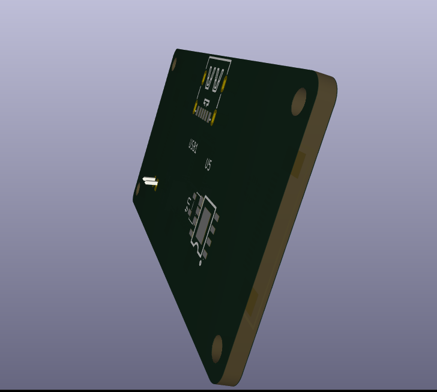

Also caught this being two NPN transistors when its should be a NPN and a PNP transistor

The PNP transistor is the main switch for making the power flood in
The NPN transistor reaches out and then pulls down the handle to unlock the door.

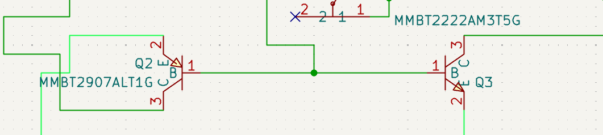

Here's the main pcb:

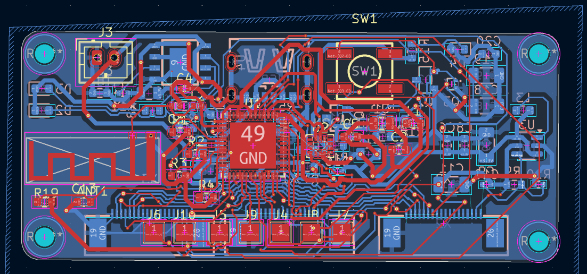

Routing WAS VERY tough with this one

# Entry 13 - 06-21-26 - Making the CAD for the design
Okay next would be the 3D model design...

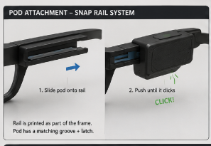
I want to replicate something like this. Not sure how but I'll make it work.

Making pod number 1!
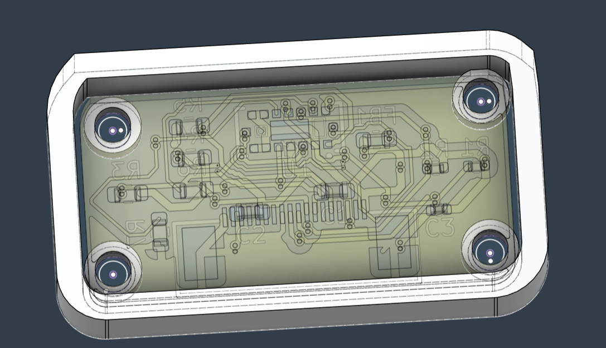

it's surprisingly easy. You just have to really do offset and then put in the standoffs.

I haven't combined it yet

Next would be the temples of the glasses. You just create a 95 mm line to the right and then make a 45 degree angled line. Replace that line with a 3 point fix-point spline. Combine both and extrude!!

Now go to the top-bottom view and create a three point spline that encomapsses the entire thing. Extrude then intersect it with the blocky temple to make it have a smooth look!

Okay I will also be modifying the glasses temple to be according to a FPC cable 

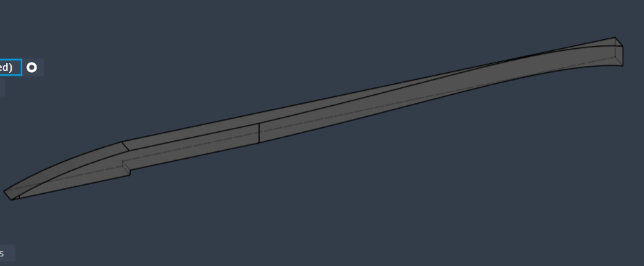

Here's how the temples will be like. Will add snap rail thing.

Oh yeah, apparently, that type of mechanism is called a sliding dove tail. I simply just used the flat side of the templse and then created some sort of rail with an extrusion of 1.2mm

Then after that, I went and refined ALOT of stuff. I didn't have time to journal. But after this, it is most likely the files you see now.

Yeah honestly, in the end I decided to just end it there for now.

HAD A FRIEND check it but fallout submissions are gonna be due TT.
# Entry 14 - 06-21-26 - Making the zine + submitting requirements

Yep! Exactly what the title of the journal is.
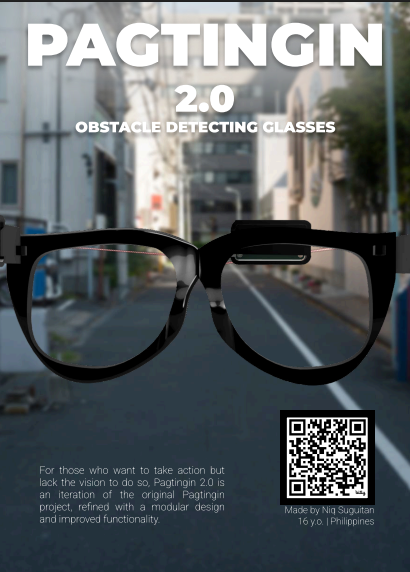