# Pagtingin (Obstacle Detecting Glasses) 2.0

## Project Aims

The Pagtingin obstacle detecting glasses aims to help visually impaired people to easily detect obstacles in front of them through innovative glasses. While traditional walking sticks indeed help in detecting obstacles on the ground, they often fail to identify objects at chest or head level, such as low-hanging branches, open cabinets, or protruding signs. 

Hence, Pagtingin aims to aid this limitation and ensure a safe journey of navigation. Whether indoors or outdoors, the device will be able to identify potential hazards through a Time-of-Flight sensor and send real-time audio feedback, which helps users to be much more confident and safe in the user's day-to-day lives.

Pagtingin 2.0 uses a modular approach instead of a tightly coupled design, making the system easier to iterate on and refine over time. Some design changes and iterations also have been made.

## Zine
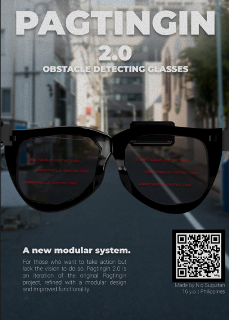

## Prototype Concept
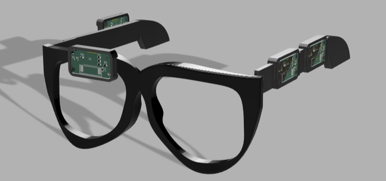

## PCB 

### Main Module

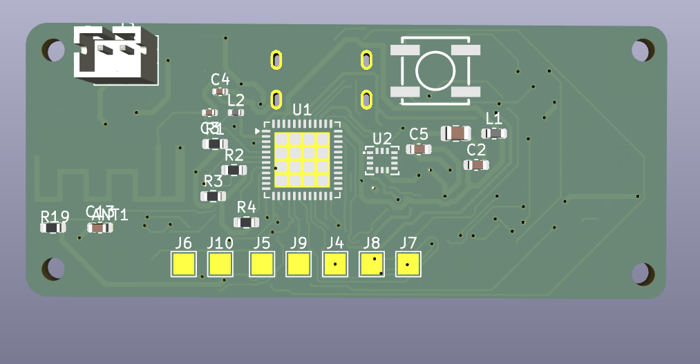
Image 1. Main PCB Module Front View

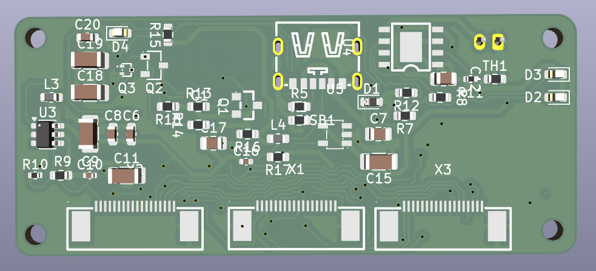
Image 2. Main PCB Module Backk View

### Audio Module
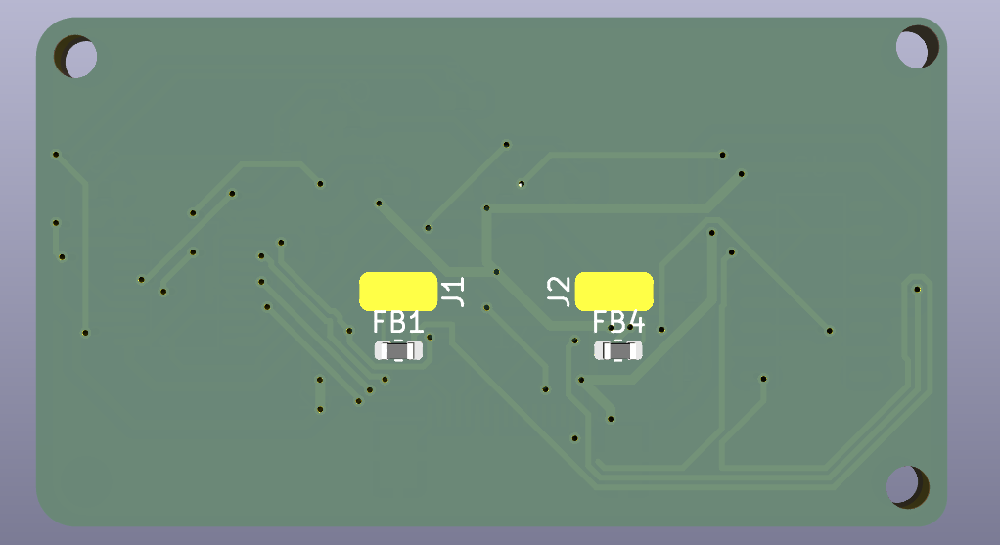
Image 3. Audio PCB Module Front View

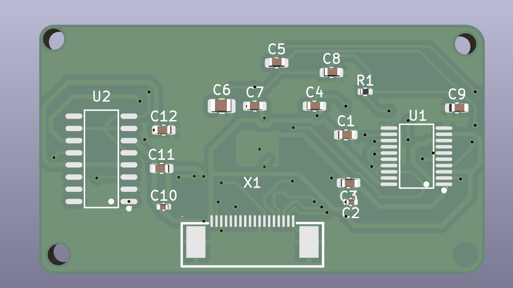

Image 4. Audio PCB Module Back View

### Sensor Module

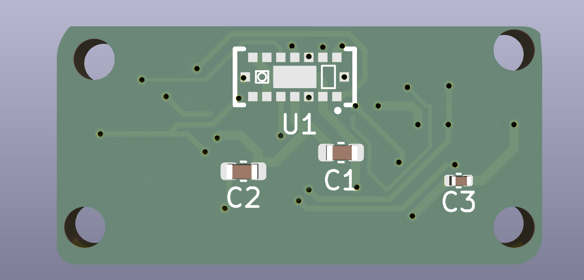
Image 5. Sensor PCB Module Front View

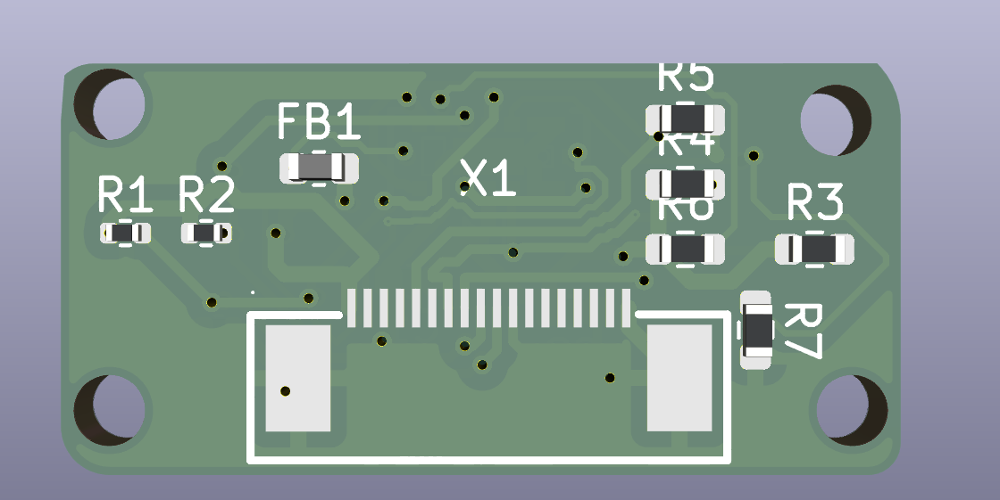
Image 6. Sensor PCB Module Back View

## CAD

### Glasses Frame (with new hinges)

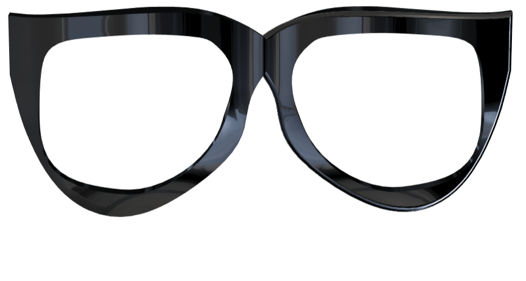
Image 7. Glasses Frame Front View

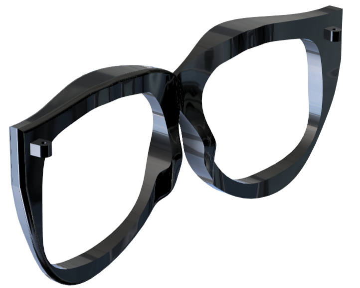
Image 8. Glasses Side View

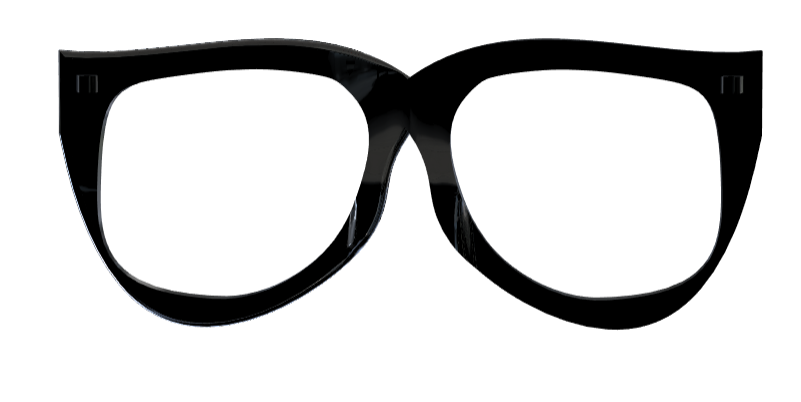
Image 9. Glasses Frame Back View

### Temples

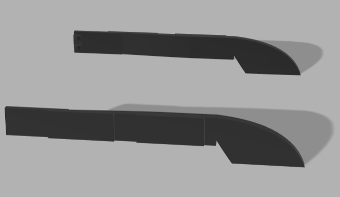
Image 10. Glasses Rail Side View

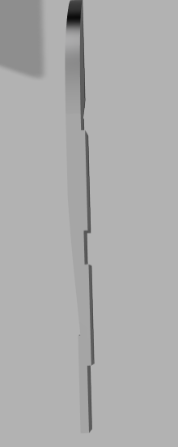
Image 11. Glasses Temple Top View

### Module Pod
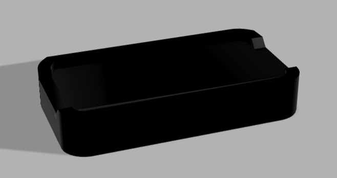

## 3D Printing
In terms of 3D printing, it might be better to print this in resin since the glasses frame will require precise dimensions. You may be able to print this in FDM, but it is recommended for the parameters to be as precise as possible.

## BOM

### BOM
[Bill of Materials](BOM.csv)

## Firmware
Still in progress. You may see previous prototypes in the folder for previous version's firmware. But for the firmware, I am planning to use the ESP-IDF in programming it. I chose the ESP-IDF because it allows full control over the ESP32-PICO-D4's peripherals and such. (also because I wanna challenge myself)
